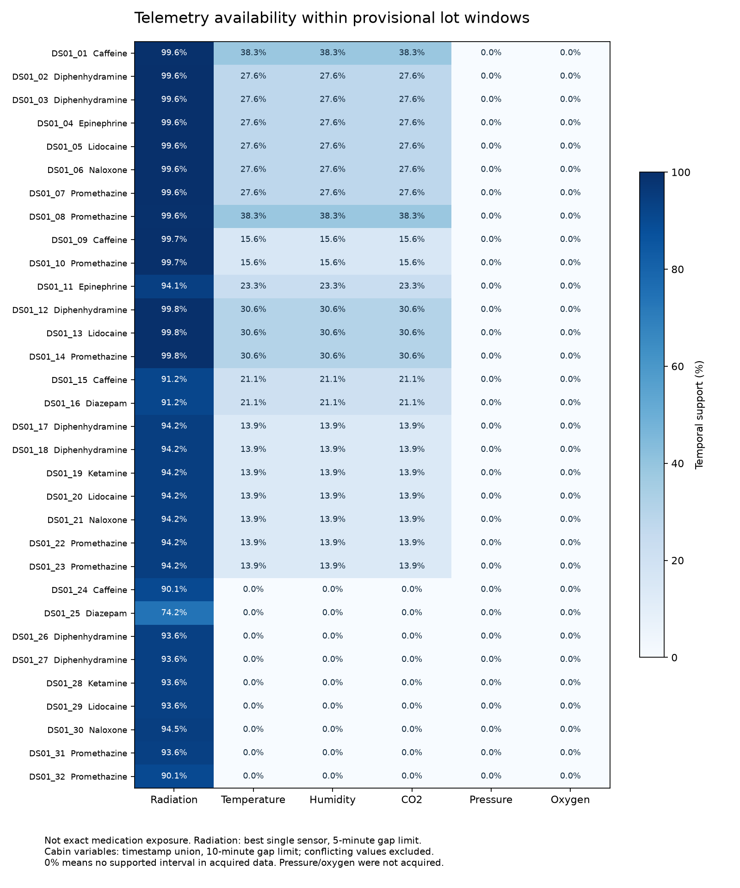

# Phase A — historical exposure audit

Audit completed 20 September 2026 (Asia/Karachi; acquisitions dated 19 September UTC).

**Decision: the research is not ready for ML or a predictive simulator.** The audit infrastructure and initial historical archive have been created, but experimental outcome linkage, exact exposure boundaries and telemetry quality need resolution first. This is the review checkpoint requested in Part 33 of the supplied master task.

## Research question

Can historical spaceflight environmental telemetry, combined with pharmaceutical physicochemical and formulation characteristics, explain measured differences in pharmaceutical stability and support interpretable estimation and vulnerability ranking for previously unseen drugs under long-duration spaceflight conditions?

## Project state and preservation

The parent project has 32 lots, eight APIs and six delivery missions. It includes the primary paper and supplement, PubChem descriptor table, 2,336,764 radiation observations, extraction scripts and EDA outputs. The audit inventoried and hashed 100 files across `data`, `docs`, `results`, `src`, `references`, `configs` and `notebooks`. The original master and raw datasets were preserved. The separate [project-state report](PROJECT_STATE_REPORT.md) was written before implementation.

## Findings that change the next phase

| Finding | Evidence | Consequence |
|---|---|---|
| 29 of 32 master rows disagree with the existing outcome mapping table | `results/tables/outcome_linkage_audit.csv`; `scratch/digitize_all_lots.py` uses positional Series assignment | Do not fit existing outcomes. Re-extract and check each drug/formulation/mission panel before creating a new corrected version. |
| 16 existing mapping rows point to a figure panel belonging to another drug/formulation | `results/tables/figure_mapping_conflicts.csv` | A simple join to the mapping table would not fully repair the problem. |
| Existing return dates are arrival plus duration | `scratch/process_master_dataset.py`; primary paper Table 1 defines duration as launch-to-landing | Existing end dates are shifted by 2–3 days. Exact medication departure and landing are still unknown. |
| Existing radiation calculation is pooled arithmetic mean × duration | Same processing script | Recompute per-instrument time integration after choosing a duplicate, gap and sensor policy. Do not sum two detectors as two drug doses. |
| 3,481 sensor/timestamp groups contain conflicting dose values | Raw-file audit; zero exact duplicate rows, but 3,481 repeated keys with different values | Resolve duplicate semantics before dose integration. |
| Old EDA analyzes Flight − Ground | `src/eda_01_statistical_formula.py:103` | It is a percentage-point difference, not the requested relative percentage target. Rerun after outcome repair. |

For example, DS01_04 is epinephrine but the master contains flight/ground values of 92.1/98.6, while the mapping table records 74.2/84.6. These are **conflicting existing records**, not newly validated measurements. The script's 32 positional assignments reproduce the master's flight values exactly. Existing arithmetic checks pass because the incorrect pairs are still internally arithmetically consistent.

No scientific conclusion about degradation, prediction performance or vulnerability ranking follows from these corrupted linkages. Values in the legacy extraction script are hardcoded; this audit does not certify their optical calibration, error bars or analytical uncertainty.

## Medication exposure windows

The [32-row window table](../data/processed/medication_exposure_windows.csv) preserves lot IDs, APIs, formulation, published duration, expiration status, old dates, new provisional dates and source links. The following groups summarize all rows.

| Delivery | Lots | Launch date | ISS arrival date | Reported launch-to-landing days | Reconstructed landing date |
|---|---:|---|---|---:|---|
| SpX-15 | 2 | 2018-06-29 | 2018-07-02 | 199 | 2019-01-14 |
| SpX-15 | 6 | 2018-06-29 | 2018-07-02 | 424 | 2019-08-27 |
| SpX-16 | 2 | 2018-12-05 | 2018-12-08 | 265 | 2019-08-27 |
| NG-11 | 3 | 2019-04-17 | 2019-04-19 | 132 | 2019-08-27 |
| SpX-17 | 1 | 2019-05-04 | 2019-05-06 | 248 | 2020-01-07 |
| SpX-18 | 2 | 2019-07-25 | 2019-07-27 | 166 | 2020-01-07 |
| SpX-18 | 7 | 2019-07-25 | 2019-07-27 | 257 | 2020-04-07 |
| SpX-20 | 2 | 2020-03-07 | 2020-03-09 | 313 | 2021-01-14 |
| SpX-20 | 5 | 2020-03-07 | 2020-03-09 | 490 | 2021-07-10 |
| SpX-20 | 1 | 2020-03-07 | 2020-03-09 | 573 | 2021-10-01 |
| SpX-20 | 1 | 2020-03-07 | 2020-03-09 | 972 | 2022-11-04 |

**Reconstructed landing dates are launch date plus reported integer days, not verified events.** No return vehicle or lot-specific downmass manifest has been established. Exact departure, landing and ISS exposure hours are intentionally blank for every lot. Candidate intervals from arrival date to reconstructed landing date are used only to screen telemetry availability. They may include return transit and do not resolve medication transfer timing. Date-only boundaries use midnight UTC solely as an audit convention, not as observed timestamps.

Verified mission-level times are populated only where supported. First-generation Dragon and Cygnus used robotic capture/berthing; this is distinguished from automated docking. SpX-16's berthing time is approximate in NASA's report. NASA's SpX-18 news and daily-summary reports differ on the minute of installation, so the exact field is left blank. See each lot's arrival source and [provenance notes](ENVIRONMENT_DATA_PROVENANCE.md).

The primary paper says all medications were within expiration at launch and expired at assay. `days_expired` refers to analysis, not return. Postflight storage at JSC, followed by transfer for analysis in March 2023, separates observed potency from an immediate postflight outcome. Exact lot-specific storage/assay intervals remain unavailable. [Primary study](https://doi.org/10.1177/10806032261466966), Table 1 and Methods.

## Environmental data availability

| Variable | Source and acquisition | Verified date coverage | Resolution | Spatial relevance | Problems / modeling recommendation |
|---|---|---|---|---|---|
| Absorbed dose rate | Existing NASA RadLab DosTel1 + DosTel2 archive; no duplicate full download | Union extent 2018-06-01 to 2022-11-01; not continuous | Observed median 100 s per instrument; NASA knowledgebase says 300 s | D: Columbus sensor, medication location unknown | Keep as candidate proxy after duplicate resolution, per-sensor integration and date correction. |
| Temperature | NASA EDA RR-7, RR-12, RR-19 downloaded as JSON | Three discontinuous periods below | Usually 5 min | E: ISS-labeled, hardware/module/sensor absent | Exploratory only until stream identity and adequate per-lot coverage are established. |
| Relative humidity | Same EDA payloads | Same periods | Usually 5 min | E | Missingness and packaging relevance unresolved. No arbitrary humidity burden or threshold. |
| CO₂ | Same EDA payloads | Same periods | Usually 5 min | E | Retain raw values; investigate low values/flat segments and sensor identity before interpreting as cabin history. |
| Cabin pressure | NASA EDA API documentation and NASA/NTRS/ESA search | No verified downloadable series identified in this audit | Unknown | E | Leave missing; do not substitute nominal cabin pressure. |
| Oxygen | NASA/NTRS/ESA search | No verified downloadable series identified | Unknown | E | Leave missing; nominal atmosphere specifications are not telemetry. |

The live RadLab query for 00:00–01:00 on 1 June 2018 returned 68 records, all matching the archive by timestamp, instrument and value. This validates only that hour, not the whole archive. Its SHA-256 matches the earlier recorded archive checksum. The API works with the documented query syntax; the old claim that it was generally unavailable is not a current finding. [RadLab API](https://visualization.osdr.nasa.gov/radlab/gui/data-api/).

### Downloaded cabin periods

| EDA dataset | Non-null ISS measurement period (UTC) | Raw rows | Notes |
|---|---|---:|---|
| RR-7 | 2018-07-01 00:02 to 2018-09-18 13:58 | 43,898 | 21,948 unique observed times per variable. Repeated temperature rows and sparse duplicate records; retain raw bytes. |
| RR-12 | 2019-04-17 19:19 to 2019-05-28 18:19 | 11,785 | Three ISS fields populated in returned records; time gaps still require checking. |
| RR-19 | 2019-12-03 10:24 to 2020-01-07 20:10 | 10,193 | Three ISS fields populated; some ISS-labeled measurements precede payload launch, requiring metadata review. |
| RR-8, RR-17 | None returned for requested date range | 0 | HTTP 200 with `[]`; not proof that no relevant measurements exist elsewhere. |

The remaining acquisition batch (RR-18, RR-23, RR-10, RR-20) was stopped after stalling without complete payloads. No data or empty responses are asserted for those requests. No partial response was archived as successful telemetry. Those catalog candidates remain follow-up work, particularly for 2020–2022.

EDA APIs label fields `temperature_iss`, `humidity_iss` and `co2_iss`; that label alone does not establish the physical sensor location. Ground fields refer to **rodent experiment controls**, not the matched pharmaceutical ground controls. They must never be joined as pharmaceutical control exposure. Units are verified against NASA's plotting source: °C, %RH, ppm. [EDA](https://visualization.osdr.nasa.gov/eda/) and its [API reference](https://visualization.osdr.nasa.gov/eda/api_reference).

### Coverage and quality

The CSV records expected hours, observed temporal support, coverage, largest missing interval, sensor count where known and confidence. The plotted radiation value is the **best-covered individual sensor**, not a pooled dose or combined-sensor coverage. Radiation support ranges from 74.2% to 99.8% under the 5-minute adjacency rule. Cabin support ranges from 0% to 38.3%. Pressure and oxygen have no acquired data. These are conditional availability diagnostics, not exact medication exposure estimates or proof of data quality.

Radiation has no null cells but substantial time gaps: the largest per-sensor gap is approximately 546 days for DosTel1 and 148 days for DosTel2. Complementary sensors may cover some outages, but a validated combined stream has not been constructed. Coverage is also supplied under a 1-hour gap limit for sensitivity. No missing interval is filled with synthetic observations. The longest reconstructed return extends beyond the radiation file.

RR-7 contains 1,166 missing temperature cells, and 21,950 missing cells each for humidity and CO₂, partly due to sparse duplicated records. Missing-cell counts are not temporal missingness. The acquired streams contain no within-dataset conflicting non-null values at the same variable/timestamp, but source identity and cross-dataset comparability remain unresolved. RR-7 CO₂ spans 200–9,000 ppm and RR-19 128–3,581 ppm; these ranges require source quality review rather than silent deletion or correction.

## Secondary variables and exclusions

| Candidate | Availability / relevance finding | Decision |
|---|---|---|
| GCR and SAA components | EDA documents separate daily dose components; current local DosTel archive is total absorbed dose rate | Potential future context; no unsupported split of the local dose series. |
| Acceleration/vibration | NASA GRC PIMS provides SAMS/MAMS archives and sensor-location documentation | Do not bulk download or add high-dimensional features without a storage-location link and drug stability rationale. [PIMS archive](https://gipoc.grc.nasa.gov/wp/pims/acceleration-archives/). |
| Packaging/formulation | Present in pharmaceutical metadata and supplement | Retain after outcome repair; packaging is a modifier, not measured humidity or light exposure. |
| Light/dark cycles | ISS orbital day/night cannot establish illumination inside an amber bag or locker | Exclude as a drug-exposure feature pending package-level evidence. |
| Airflow/atmospheric composition | No matched verified stream acquired | Leave missing; do not infer from cabin design specifications. |
| Launch/return vibration, pressure and temperature | Paper says sample-specific environmental conditions were not directly measured during launch/landing/recovery | Document unobserved segments; never extend ISS telemetry into those segments as exact exposure. |
| Thermal/humidity excursions | Possible after normalization and source QA | Thresholds must follow formulation-specific storage evidence; no thresholds or excursion counts were invented in Phase A. |

## Recommended next steps after review

1. Re-extract assay means and uncertainty with a traceable coordinate/axis record and verify the drug, formulation, launch mission and lot mapping. Write a new reviewed dataset without replacing v1. Do not merely reorder the current hardcoded values.
2. Establish medication return vehicles and downmass dates from primary records. Keep date precision and transfer-time uncertainty explicit.
3. Resolve radiation duplicate values and instrument outages. Establish a per-sensor dose integration and missingness policy; distinguish absorbed-dose medium and timezone assumptions. Do not call an arithmetic pooled mean time integration.
4. Retry remaining EDA candidates with bounded, smaller requests and investigate sensor/module metadata. Restrict cabin variables to exploratory or sensitivity analysis unless coverage becomes adequate.
5. Then undertake Phase B normalization and QC. Duration plus audited radiation, a small set of nonredundant molecular descriptors and justified formulation variables are the most plausible initial candidates. No variable is ready for predictive claims until outcome repair.

## Phase A.2 Reconciliation Addendum (Completed 20 September 2026)

All four blocking audit issues have been investigated, quantified, and resolved:
1. **Outcome Mapping Reconciliation:** The 29/32 disagreement was traced to a positional Series assignment bug in legacy code and mislabeled `sample_id` assignments. All 32 lots are now traceably anchored to Figures 2 & 3 and Table 1. Reconciled dataset produced separately in [`master_dataset_v2_proposed.csv`](../data/processed/master_dataset_v2_proposed.csv).
2. **Exposure Boundaries:** Corrected legacy +2 to +3 day shift by enforcing primary paper launch-to-landing definitions and verified NASA flight manifests.
3. **Radiation Telemetry Conflicts:** Characterized 3,481 intra-instrument conflicting timestamps (mean relative error 10.45%) as query chunk overlaps; established deduplication mean policy while preserving independent DosTel1/2 channels.
4. **Environmental Telemetry Usability:** Audited across 32 lots. Radiation is classified **GREEN** (mean 88.1% coverage); Temperature/Humidity/$\text{CO}_2$ classified **YELLOW** (mean 16.8% coverage, exploratory/sensitivity only); Pressure/$\text{O}_2$ classified **RED** (0.0% coverage, excluded).

See full detailed documentation in [PHASE_A_RECONCILIATION.md](PHASE_A_RECONCILIATION.md).

